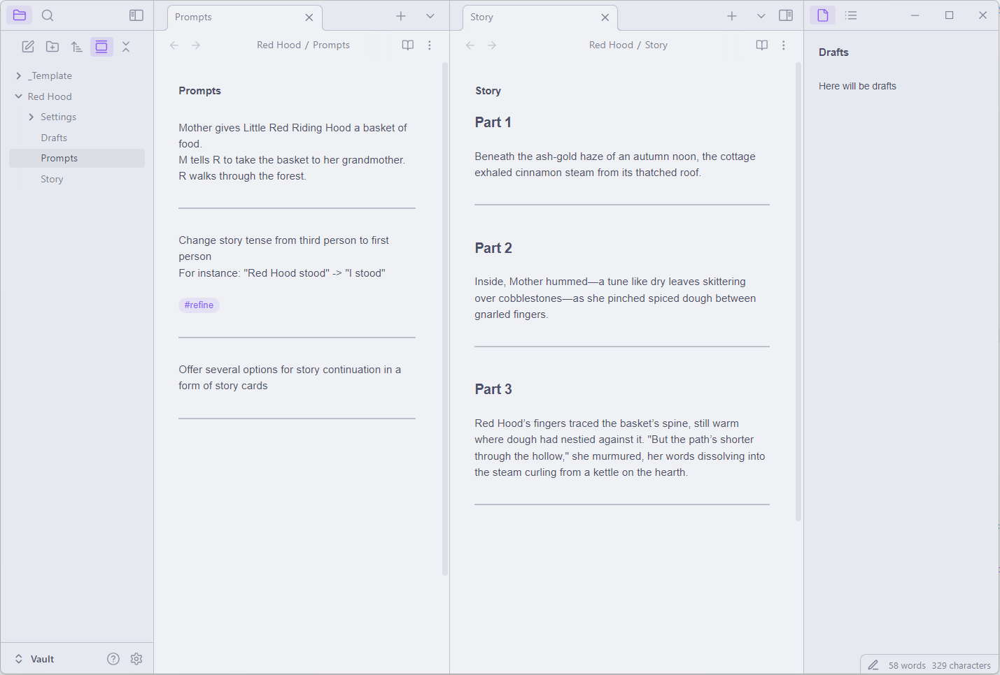

This repo features a Python/Javascript project that allows to use **Obsidian** for AI assisted **story writing** via **OpenRouter** API.  

## Installation instructions for Windows:
1. Install [Python 3.12](https://www.python.org/downloads/release/python-3122/)  
2. [Download](https://github.com/aksenov-fx/Obsidian-AI-Story-Writer/archive/refs/heads/main.zip) and unzip the contents of the repository  
3. Go to script folder and run `initialize.bat`  
The script will install Python dependencies and ask for your API key
4. Run `start.bat`  

## How to use
Open the Vault folder as a vault in Obsidian and set cursor position on a prompt

Use the following hotkeys:  
**Alt+S** - Set prompt  
**Alt+W** - Write scene  
**Alt+C** - Custom prompt  
**Alt+A** - Rewrite selection  
**Alt+Z** - Delete last response  
**Alt+~** - Stop writing  
**Alt+T** - Manage workspaces
**Alt+E** - Save and change workspace

**Alt+1-5** - Set model number 
Models are listed in `_includes\settings\models.yaml`  
Default model can be changed in `_includes\settings\settings.yaml`

**Alt+R** - Reset model

## Obsidian commands
**Write Scene**  
Append writing instructions to a user prompt and write a scene  

**Custom Prompt**  
Make prompt without writing instructions  

**Rewrite selection**
Rewrite selected text according to prompt

**Rewrite part**  
Rewrite a selected part of the story according to prompt  

**Rewrite this and the following parts**  
Rewrite selected and the following parts  

**Regenerate**  
Regenerate a selected part of the story  

**Add Part**  
Add a new story part after a selected part  

**Summarize story**  
Ceate a file with summary for each part

**Update summary**  
Summarize new story parts

*Please check python app terminal output to understand how prompts are composed for each command*

## Optional steps
- Edit `_includes\settings` files to change default settings, models, prompts and abbreviations
- Edit files in story `Settings` folder in Obsidian to change settings individually per story

## Settings

**use_summary**  
Replace story parts with summaries in API request to reduce token usage  
The last story part will remain original to preserve writing style

**summary_model**  
Model used to summarize story.  

**trim_history**
Exclude first paragraphs until story lengh matches max_tokens

**include_previous_part_when_rewriting**  
If False, only the current part text will be included in API request when rewriting
Makes sense when the changes do not require story context
For example, when changing story tense, style etc.

**print_reasoning**  
Print reasoning in terminal when using models that output reasoning tokens, like DeepSeek R1  

## How it works
To get a response, **Obsidian** sends a TCP request to python app, which listens on port **TCP 9993**. The app gets a response and writes it to MD file, while **Obsidian** displays the changes in real time.  

## Credits:
Dmitry Savosh for [Remember cursor position](https://github.com/dy-sh/obsidian-remember-cursor-position) plugin  

---
\
Try app in VS Code notebooks:  
